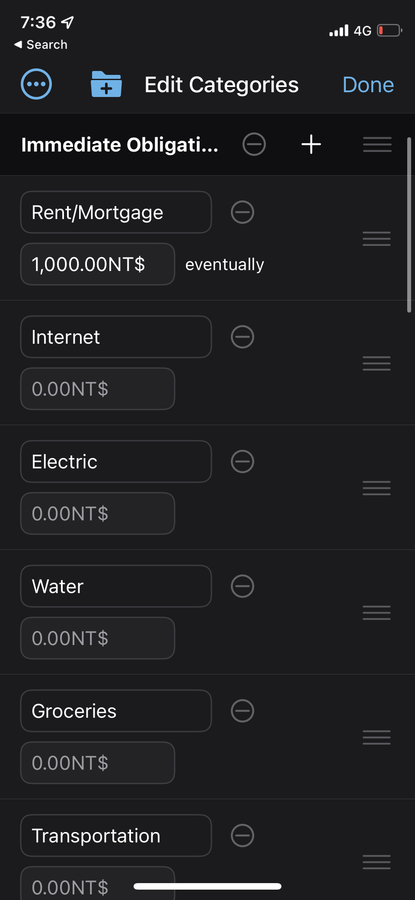
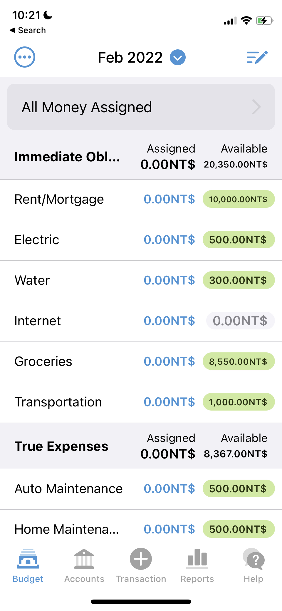
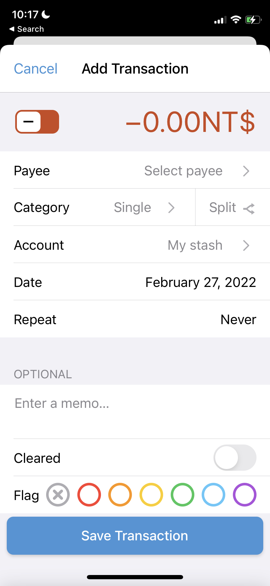

# Expense-Tracker
A budgeting app to let you keep track of your expenses. This budgeting app gets its UI inspiration from the YNAB (You Need A Budget) app. It is meant to be a free-tier simplified version of YNAB that offers the core features only.

## General Features TODO list
### Create a Category
* Clicking the pen icon on main page should redirect to /categories (UI shown below)
* Clicking the folder icon in UI should give option to create new category name
* Plus icon next to each category should give the option of adding an expense to a given category with a field to set the budget as well
* select/add category, enter amount, select monthly/weekly/biweekly/yearly
* if monthly, select due date
* if weekly, select day (Mon-Sun), and calculate total based on days in current month
* if yearly, select due date and calculate monthly goal by dividing the remaining by the months left

### UI for /categories

### Delete a Category (NOTE: just hides the category in the hidden category-group)
* (Optional:) Move money out of category for current month
* Select a category, and delete it

### Reorder Categories
* Drag and drop to reorder categories
* (Optional:) Order determines priority which determines what categories auto-assign gives to

### Add Bank Account
* Add type (savings, checking)
* Enter current account balance (cleared, no credit limit)

### Enter paycheck date(s)
* Helps to auto-assign money (ie. assign money to category upto and including payday)

### Auto-assign Money
* Press auto-assign button to have software assign money based on current date, due dates, and payday

### Overspent, In-progress, and Overassigned
* Negative values are overspent (red coloured)
* Positive values under max are in-progress (yellow)
* Positive values equal to or over max are overassigned (green)

### Overspent
* Select two categories and add money to the one that has been overspent

### Import Data from Bank Account
* For each bank account, import bank transactions for a file

### Assign Money
* Allow user to assign a monetary amount, as well as an expression

### Credit Card Debt Protection
* Create debit card
* Select date to pay of debt by, or amount per month
* Add transaction that takes money from a category (ie. transportation)
* Auto subtract money from that category (ie. transportation)
* Goal is reached when total spending on credit card + payment amount per month is payed

### Category Groups
* Immediate Obligations: TODO
* True Expenses: non-monthly expenses, such as maintenance costs

### Money Age
* Calculate the age of the money in the account

## Index Page UI

### Index Page UI & Features Requirements
* Month-Year should be centered on "header"
* "Edit-Categories" button should be right-aligned on "header". Clicking "Edit-Categories" should take you to a new page where you can add new categories and set the "budget" for each category for the month.
* "Category-Group" needs two main columns: "Category-Group-Name" and "Percentage-Spent"
* "Category" needs two main columns: "Category-Name" and "Spending-Pill"
* "Footer" should include a "Add-Transaction" button which redirects users to the Add Transaction UI

## Add Transation UI

### Add Transaction UI & Feature Requirements
* Clicking the "+" icon on the footer should redirect to /add-transaction
* Create a toggle UI for toggling between expenses and income. Create field for storing numerical value. Store state in React.
* Create a category field which shows a dropdown of all categories. Store state in React.
* Create a date field which defaults to today. When date is clicked it should open up a calendar to change date. Store state in React.
* Create a memo field to store a note with transaction. Store state in React.
* Clicking the save transaction button can just log the state of the component for now

## Notes
- [React](https://reactjs.org/)
- [Tailwind](https://tailwindcss.com/)
- [Tailwind cheatsheet](https://tailwindcomponents.com/cheatsheet/)
- [You Need a Budget (YNAB)](https://www.youneedabudget.com/)
- [Express Cheat Sheet](https://expressjs.com/en/starter/examples.html)
